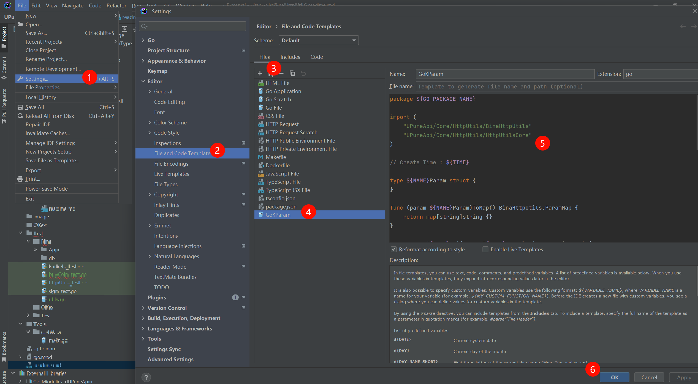
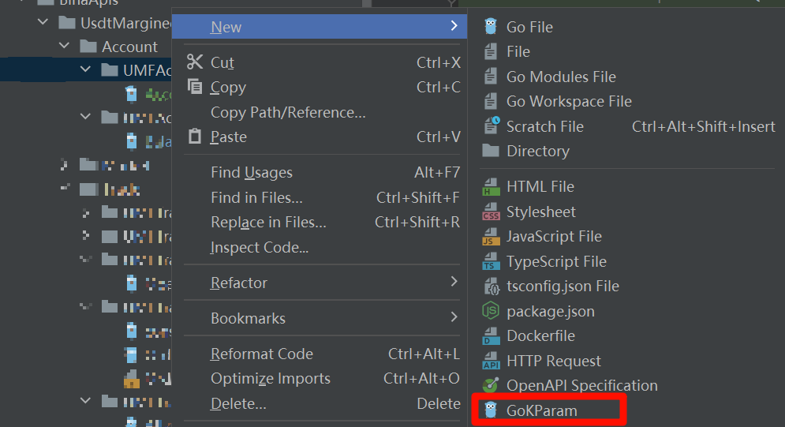

# 编写说明

- API 编写规则

> Api.go  
> &nbsp;&nbsp;&nbsp;&nbsp;&nbsp;&nbsp;定义 api 的接口类

> BinaHttpUtils.go  
> &nbsp;&nbsp;&nbsp;&nbsp;&nbsp;&nbsp;重写 HttpUtilsCore/HttpUtils.go 中的请求；  
> &nbsp;&nbsp;&nbsp;&nbsp;&nbsp;&nbsp;主要是 Request 方法，加入签名方法

> UsdtMarginedFutures U本位接口  
> > Account  
> > 交易账号接口  
> 
> > Market  
> > 市场接口  
> 
> > Trade  
> > 交易接口  

- UsdtMarginedFutures 文件夹的编写规则

> 目录结构

```text
└─UsdsMarginedFutures   U本位合约
    └─Account             账户接口目录
        └─UMFAccountBalance 账户余额查询接口
            ├─balance.go 账户余额查询接口
            │
            └─...其他拆分文件

UMF-Account-Balance.go
UMF 是 UsdsMarginedFutures 的前缀
Account 是 上一级 的目录文件名
Balance 是具体接口名称
```

> 接口文件编写规则

```go
package BUMFAccountBalance

import (
	"UPureApi/Core/HttpUtils"
	"UPureApi/Core/HttpUtils/BinaHttpUtils"
	"encoding/json"
	"fmt"
)

// BalanceParam 接口名称+Param
// 注意，不要加 s
type BalanceParam struct{}

// 接口必须实现的方法
func (balanceParam BalanceParam) ToMap() BinaHttpUtils.ParamMap {
	return map[string]string{}
}

// CreateBalanceApi 注意，这里结尾是 Api
func CreateBalanceApi(balanceParam BalanceParam) BinaHttpUtils.Api {
	return BinaHttpUtils.Api{
		Path:        "/fapi/v3/balance", // 请求路径
		HttpMethod:  HttpUtils.HttpGet,  // get 请求
		QueryParams: balanceParam,       // get 参数
		BodyParams:  nil,                // body 参数
		Sign:        true,               //需要签名
		Header:      nil,                // 特定的头部信息
	}
}

type BalanceResponse struct {
	AccountAlias       string `json:"accountAlias"`
	Asset              string `json:"asset"`
	Balance            string `json:"balance"`
	CrossWalletBalance string `json:"crossWalletBalance"`
	CrossUnPnl         string `json:"crossUnPnl"`
	AvailableBalance   string `json:"availableBalance"`
	MaxWithdrawAmount  string `json:"maxWithdrawAmount"`
	MarginAvailable    bool   `json:"marginAvailable"`
	UpdateTime         int64  `json:"updateTime"`
}

// ParseBalanceResponse 
// Parse + Balance + Response
func ParseBalanceResponse(str string) []BalanceResponse {
	var bResp []BalanceResponse
	err := json.Unmarshal([]byte(str), &bResp)
	if err != nil {
		fmt.Println(err.Error())
	}
	return bResp
}

// ParseBalanceResponseTable 
// Parse + Balance + Response + Table
//type TableBalance struct {}
func ParseBalanceResponseTable(x X) TableBalance {
	return TableBalance{}
}

// PParseBalanceResponseTable 合并上面两个接口
// ParseBalanceResponse
// ParseBalanceResponseTable
func PParseBalanceResponseTable(s string) TableBalance {
	
}
```

- GoLand 模板

> 建议将下面内容作为 goLand 的模板进行使用






```gotemplate
package ${GO_PACKAGE_NAME}

import (
	"UPureApi/Core/HttpUtils/BinaHttpUtils"
	"UPureApi/Core/HttpUtils/HttpUtilsCore"
)

// Create Time : ${TIME}

type ${NAME}Param struct {
}

func (param ${NAME}Param)ToMap() BinaHttpUtils.ParamMap {
    return map[string]string {}
}

func Create${NAME}Api(param ${NAME}Param) BinaHttpUtils.Api {
    return BinaHttpUtils.Api{
    NoTimeStamp: false,
		Path:        "",
// 		HttpMethod:  HttpUtilsCore.HttpGet,
//		HttpMethod:  HttpUtilsCore.HttpPost,
		QueryParams: param,
		BodyParams:  nil,
//		Sign:        true,
//		Sign:        false,
		Header:      nil,
    }
}

// type ${NAME}Response struct {}

// func ParseResponseToBalance(str string) ${NAME}Response {
// 	var resp ${NAME}Response
// 	err := json.Unmarshal([]byte(str), &resp)
// 	if err!=nil {
// 		fmt.Println(err.Error())
// 	}
// 	return resp
// }
```

- API 编写

[githu API](https://binance-docs.github.io/apidocs/futures/cn/#trade-3)

[现货 API DOC](https://developers.binance.com/docs/zh-CN/binance-spot-api-docs/rest-api)

[合约 API DOC](https://developers.binance.com/docs/zh-CN/derivatives)