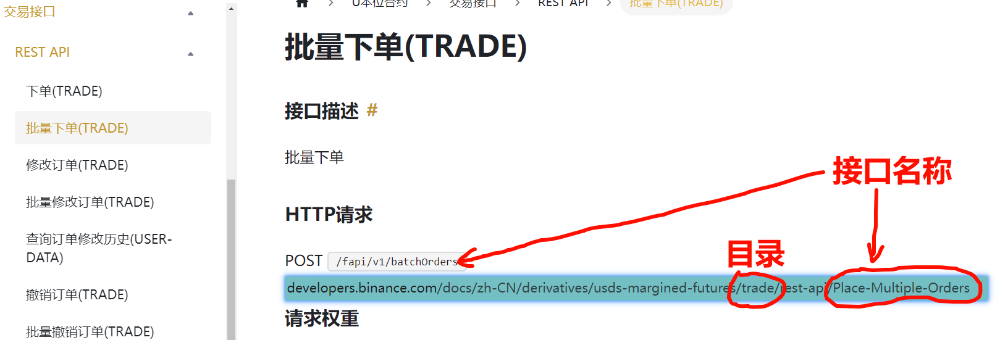

# 编写说明

- API 编写规则

> Api.go  
> &nbsp;&nbsp;&nbsp;&nbsp;&nbsp;&nbsp;定义 api 的接口类

> BinaHttpUtils.go  
> &nbsp;&nbsp;&nbsp;&nbsp;&nbsp;&nbsp;重写 HttpUtilsCore/HttpUtils.go 中的请求；  
> &nbsp;&nbsp;&nbsp;&nbsp;&nbsp;&nbsp;主要是 Request 方法，加入签名方法

> UsdtMarginedFutures U本位接口  
> > Account  
> > 交易账号接口  
> 
> > Market  
> > 市场接口  
> 
> > Trade  
> > 交易接口  

- UsdtMarginedFutures 文件夹的编写规则

> 目录结构

```text
└─UsdsMarginedFutures   U本位合约
    └─Account             账户接口目录
        └─UMFAccountBalance 账户余额查询接口
            ├─balance.go 账户余额查询接口
            │
            └─...其他拆分文件

UMF-Account-Balance.go
UMF 是 UsdsMarginedFutures 的前缀
Account 是 上一级 的目录文件名
Balance 是具体接口名称
```

> 接口文件编写规则

```go
package UMFAccountBalance

import (
	"UPureApi/Core/HttpUtils"
	"UPureApi/Core/HttpUtils/BinaHttpUtils"
	"encoding/json"
	"fmt"
)

// BalanceParam 接口名称+Param
// 注意，不要加 s
type BalanceParam struct{}

// 接口必须实现的方法
func (balanceParam BalanceParam) ToMap() BinaHttpUtils.ParamMap {
	return map[string]string{}
}

// CreateBalanceApi 注意，这里结尾是 Api
func CreateBalanceApi(balanceParam BalanceParam) BinaHttpUtils.Api {
	return BinaHttpUtils.Api{
		Path:        "/fapi/v3/balance", // 请求路径
		HttpMethod:  HttpUtils.HttpGet,  // get 请求
		QueryParams: balanceParam,       // get 参数
		BodyParams:  nil,                // body 参数
		Sign:        true,               //需要签名
		Header:      nil,                // 特定的头部信息
	}
}

type BalanceResponse struct {
	AccountAlias       string `json:"accountAlias"`
	Asset              string `json:"asset"`
	Balance            string `json:"balance"`
	CrossWalletBalance string `json:"crossWalletBalance"`
	CrossUnPnl         string `json:"crossUnPnl"`
	AvailableBalance   string `json:"availableBalance"`
	MaxWithdrawAmount  string `json:"maxWithdrawAmount"`
	MarginAvailable    bool   `json:"marginAvailable"`
	UpdateTime         int64  `json:"updateTime"`
}

// ParseBalanceResponse 
// Parse + Balance + Response
func ParseBalanceResponse(str string) []BalanceResponse {
	var bResp []BalanceResponse
	err := json.Unmarshal([]byte(str), &bResp)
	if err != nil {
		fmt.Println(err.Error())
	}
	return bResp
}

// ParseBalanceResponseTable 
// Parse + Balance + Response + Table
//type TableBalance struct {}
func ParseBalanceResponseTable(x X) TableBalance {
	return TableBalance{}
}

// PParseBalanceResponseTable 合并上面两个接口
// ParseBalanceResponse
// ParseBalanceResponseTable
func PParseBalanceResponseTable(s string) TableBalance {
	
}
```

- API 编写

[githu API](https://binance-docs.github.io/apidocs/futures/cn/#trade-3)

[现货 API DOC](https://developers.binance.com/docs/zh-CN/binance-spot-api-docs/rest-api)

[合约 API DOC](https://developers.binance.com/docs/zh-CN/derivatives)

```text
└─UsdsMarginedFutures   U本位合约
    ├─Market             行情接口
    │      List.go
    │
    └─Trade             交易接口
            All.go      查询所有挂单
            const.go    常量
            OpenOrder.go    开单
            Order.go    历史订单
            Query.go    通过特定条件查询订单
            readme.md
```

- 文件命名规则

1. 目录以 文档的 URL 中 rest-api 的前一个单词为主
2. 接口名称可以是 URL 最后一个短语或请求的最后一个 单词
3. 当存在 POST PUT DELETE GET 公用一个 api 时，请使用 2 中的第一个方法



- API 编写方法

```go
package Trade

import (
	"UPureApi/Core/HttpUtils"
	"UPureApi/Core/HttpUtils/BinaHttpUtils"
	"UPureApi/Core/HttpUtils/BinaHttpUtils/BinaApis"
)

// file : TestOne.go
//type [驼峰是文件名]Params struct
type TestOneParams struct {
	// 这里将所有需要提交服务器的参数列出
	Symbol string
}

func (testOneParams TestOneParams) ToMap() BinaHttpUtils.ParamMap {
	m := map[string]string {
		"symbol": BinaApis.CheckEmptyString(testOneParams.Symbol),
    }
	return m
}
func CreateOrderAllApi(testOneParams TestOneParams) BinaHttpUtils.Api {
	// 这里根据实际写，有的接口可能同时需要 query 和 body 参数，这里只需要 query
	// 所以 bodyParams 用来一个空参数
	return BinaHttpUtils.Api{
		Path:        "/fapi/v1/allOrders",
		HttpMethod:  HttpUtils.HttpGet,
		QueryParams: testOneParams,
		BodyParams:  BinaApis.EmptyParams{},
		Sign:        true,
		Header:      HttpUtils.DefaultHeader,
    }
}
```